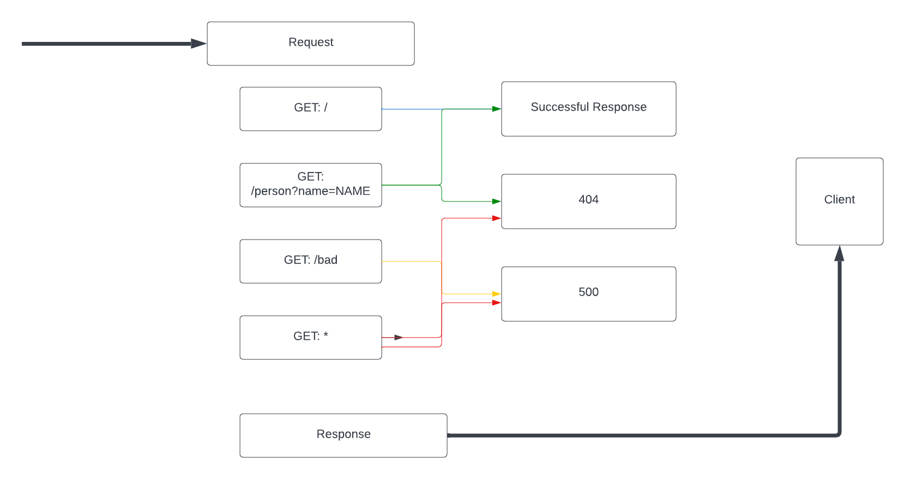

# LAB - 02

## Basic Express Server

### Author: Hayden Cleaver

- [tests report](https://github.com/HaydenCleaver/basic-express-server/actions)
- [heroku](https://hayden-basic-express-server.herokuapp.com/)
### Setup

#### `.env` requirements

- `PORT` - 3001

#### Running the app

- `npm start`
- Endpoint: `/`
  - Returns 'Home Path'
- Endpoint: `/person?name=NAME`
  - Returns 'NAME'

#### Tests

- Unit Tests: `npm run test`

#### UML

(Created with [lucid-chart](https://www.lucidchart.com/blog/types-of-UML-diagrams))

